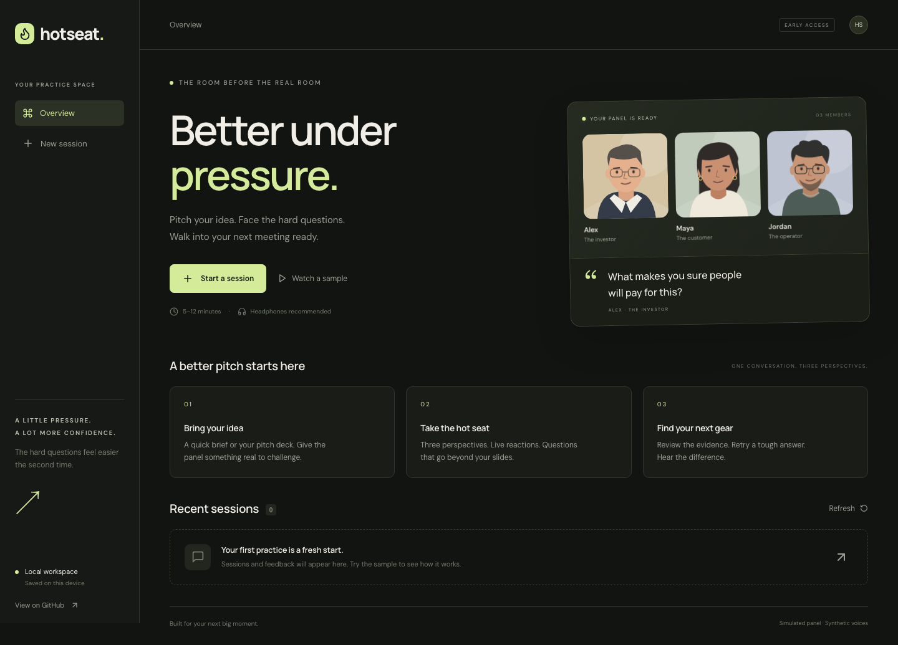
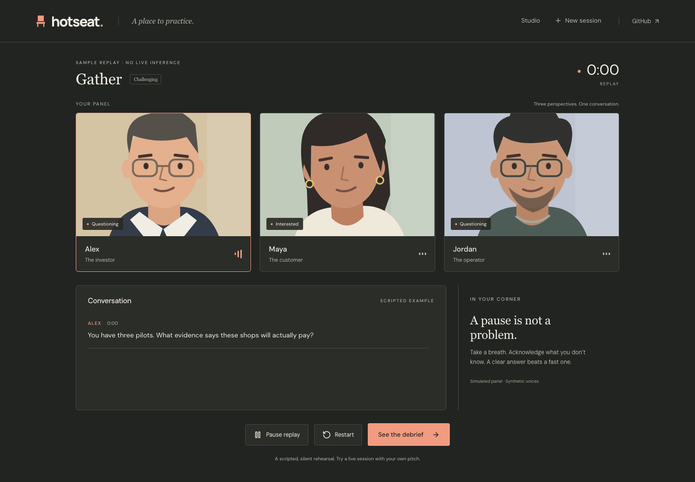
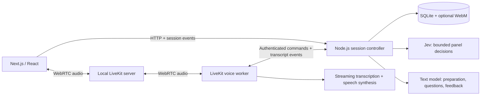

<div align="center">

# HotSeat

### Make your next pitch your best.

Practice your startup pitch with a panel that asks the hard questions.<br/>
Three perspectives. Live reactions. Another shot at the answer.

[Quick start](#quick-start) · [How it works](#how-it-works) · [Architecture](#architecture) · [Contributing](CONTRIBUTING.md)

</div>



[Watch the short sample walkthrough](docs/demo.webm) — a silent, scripted demonstration.

## Why HotSeat?

A rehearsed pitch can sound great until someone asks, “Why would customers pay for this?” HotSeat gives you a place to practice that moment: explain your idea, defend an assumption, acknowledge a gap, and try again.

- **Three perspectives:** an investor challenges the business, a customer questions the value, and an operator examines execution.
- **Adjustable pressure:** supportive questions at pauses, or more persistent challenges and controlled interruptions.
- **A panel that reacts:** illustrated characters respond to what you say; one controller manages who speaks.
- **Grounded feedback:** critiques point to actual transcript turns and offer a concrete next step.
- **Retry a tough question:** keep the question, change your answer, and review both attempts.
- **Your local workspace:** SQLite history, Markdown/JSON exports, optional audio recordings, and deletion controls.
- **A focused studio:** warm paper and ink for preparation and review, a dark practice room, keyboard controls, and reduced-motion support.
- **A key-free sample:** explore a clearly labeled, scripted replay and its debrief before configuring providers.

HotSeat is an open-source, self-hosted app for startup pitch practice. Run it locally and connect your own model providers for live sessions.

## Quick start

Requirements: **Node.js 22.23 or newer**, npm, and desktop Chrome or Edge. Docker is needed for the container workflow and is the easiest way to start the local LiveKit server.

```sh
git clone https://github.com/RaghavGarg1210/hot-seat.git
cd hot-seat
npm ci
npm run setup
npm run dev
```

Open **http://localhost:3000**, then select **Watch a sample**. No provider keys or voice server are needed for the sample.

### Enable live practice

Add keys to the generated `.env` file, then restart the app:

```dotenv
OPENAI_API_KEY=your-key
TYPESAFE_API_KEY=your-key
```

Get keys from the [OpenAI platform](https://platform.openai.com/api-keys) and [TypeSafe console](https://console.typesafe.ai/). Keys stay on the server and must never be committed. TypeSafe is optional for conservative turn-based fallback; OpenAI is required for live preparation, dialogue, and feedback.

With Docker running:

```sh
# Terminal 1: local WebRTC server
docker compose up -d livekit

# Terminal 2: voice worker
npm run agent:download -w @hotseat/server
npm run dev:agent

# Terminal 3: interface and session service
npm run dev
```

If `livekit-server` is installed natively, it can replace the first command:

```sh
livekit-server --config infra/livekit.yaml
```

Use headphones, allow microphone access, and complete the preparation screen. If voice cannot connect, the practice room offers a text continuation. Configuration defaults are in [`.env.example`](.env.example).

### Run everything with Docker

```sh
npm run setup
# Add your provider keys to .env.
docker compose up --build
```

Open http://localhost:3000. Compose runs the interface, session service/voice worker, and LiveKit. The worker shares LiveKit's network namespace so the localhost ICE address works for both the worker and the browser. This configuration is for a browser on the same machine.

Data persists in the `hotseat-data` volume. `docker compose down` preserves it; `docker compose down -v` deletes it. Native development stores data in the ignored `data/` directory.

## How it works

1. **Bring context.** Paste a brief or upload a text-based PDF, then review and correct the extracted context. PDFs are limited to 20 MB and 40 pages; scanned decks require pasted text.
2. **Choose the pressure.** Pick supportive, challenging, or intense, then a 5-, 8-, or 12-minute session.
3. **Make your pitch.** Speak with Alex, Maya, and Jordan. Pause, skip a question, interrupt, or finish whenever you need to. Keyboard shortcuts in the room: **M** to mute, **P** to pause/resume, and **N** to skip (outside text fields and controls).
4. **Find the weak spot.** Review clarity, specificity, supporting evidence, and whether you answered the question. Jump from a critique to its source turn.
5. **Try again.** Retry a question and compare your original answer with the new attempt.



## Architecture



The controller is the authority for session state, turn ownership, pressure rules, cancellation, and the speech queue. Jev evaluates bounded decisions against pitch context and recent speech; it does not generate the dialogue. A text model prepares objections and writes contextual questions and feedback. Typed contracts and runtime validation are shared across the service and interface.

One speech pipeline serves all three panelists, switching voices between turns. Decisions from outdated speech are discarded. Missing Jev results fall back to questions at completed turns; speech failures pause the session and offer reconnection or text practice.

| Area      | Technology                                                         |
| --------- | ------------------------------------------------------------------ |
| Interface | Next.js, React, TypeScript, original SVG characters, bundled fonts |
| Service   | Fastify, Zod, Node.js SQLite                                       |
| Voice     | LiveKit Agents, Silero VAD, OpenAI STT/TTS                         |
| Decisions | TypeSafe Jev, configurable through `JEV_MODEL`                     |
| Text      | OpenAI Responses API, versioned prompts                            |
| Testing   | Vitest, Playwright, labeled decision fixtures                      |

Default models are `gpt-6-sol`, `gpt-realtime-whisper`, `gpt-4o-mini-tts`, and `jev-latest`. Override them in `.env` to match models available to your provider account. The three voices are alloy, coral, and ash.

Source layout: `apps/web` contains the interface, `apps/server` contains providers, controller, API, and voice worker, and `packages/shared` contains validated contracts.

## Data and privacy

The panel and voices are synthetic. Live practice sends speech and pitch context to configured external providers; **self-hosted does not mean offline inference**.

Transcripts and feedback are stored locally. Audio recording is off by default and requires an explicit choice for each new session. When enabled, the browser mixes microphone and panel audio into a local WebM recording. Deleting a session removes its local transcript, feedback, metrics, and recording. Provider retention is separate from local deletion.

HotSeat is intended for a single person on localhost. It has no user-account system. Do not expose this configuration to the internet; see [security notes](SECURITY.md).

## Development and evaluation

```sh
npm run check             # TypeScript, lint, unit/integration tests
npm run build             # Production interface + service type check
npx playwright install chromium
npm run test:e2e          # Starts isolated local test servers
npm run format:check
npm run eval              # Baseline on the labeled smoke set
npm run eval -- --live    # Jev comparison; requires a TypeSafe key
```

The browser suite uses synthetic pitch data and captures the screenshots shown here. No live model calls run in CI.

Evaluation output is written to `evals/results/latest.json`. The set is intentionally small and hand-labeled; it is useful for regression checks, not a general accuracy claim. Reaction latency and spoken-response latency are measured separately during live sessions and included in JSON exports.

## Troubleshooting

- **Missing provider key:** update `.env` and restart the service and worker. The sample needs no keys.
- **Voice worker did not join:** start LiveKit, run `npm run dev:agent`, and check that both use the same URL, key, secret, and `INTERNAL_TOKEN`.
- **Microphone blocked:** allow access for localhost in the browser and check macOS microphone permissions. Use headphones to prevent feedback.
- **No readable PDF text:** scanned slides are not OCR'd. Paste a short brief instead.
- **Feedback failed:** your transcript remains saved. Fix provider access and select **Retry feedback**.
- **Docker unavailable:** start Docker Desktop. The sample and text practice can run natively without it.

## Limitations

This preview supports English and desktop Chrome/Edge. It does not analyze facial expressions, verify business claims, predict fundraising outcomes, or provide actual investor validation. Persona reactions are part of a practice simulation. Remote hosting, multiple users, additional scenarios, OCR, and realistic video avatars are outside the first release.

## Contributing and license

See [CONTRIBUTING.md](CONTRIBUTING.md). Licensed under [MIT](LICENSE).
